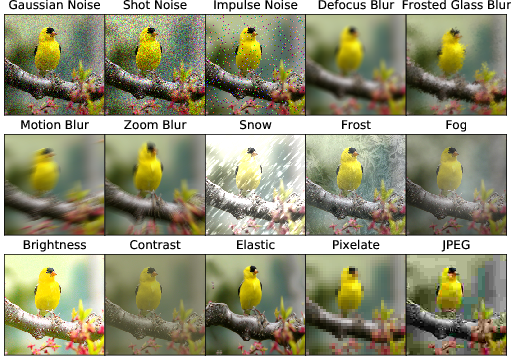

# Benchmarks for Neural Network Robustness to Common Distortions and Styles

This repository contains the datasets and some code for the paper _Benchmarks for Neural Network Robustness to Common Distortions and Styles_ by Dan Hendrycks and Tom Dietterich.

Requires Python 3+ and PyTorch 0.3+.

## ImageNet-D

[Download ImageNet-D here.](https://drive.google.com/drive/folders/1HDVw6CmX3HiG0ODFtI75iIfBDxSiSz2K?usp=sharing)

## Icons-50

[Download Icons-50 here.](https://drive.google.com/file/d/1TN5Igft9q01HZOuFlW7e8L1u5ksgVkn-/view?usp=sharing)

## Citation

If you find this useful in your research, please consider citing:

    @article{hendrycks2018robustness,
      title={Benchmarks for Neural Network Robustness to Common Distortions and Styles},
      author={Dan Hendrycks and Thomas Dietterich},
      journal={arXiv preprint},
      year={2018}
    }
