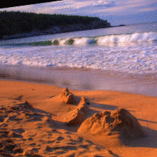

# Benchmarking Neural Network Robustness to Common Corruptions and Perturbations

This repository contains the datasets and some code for the paper [Benchmarking Neural Network Robustness to Common Corruptions and Perturbations](https://arxiv.org/abs/1903.12261) (ICLR 2019) by Dan Hendrycks and Thomas Dietterich.

Requires Python 3+ and PyTorch 0.3+. For evaluation, please download the data from the links below.

## ImageNet-C

[Download ImageNet-C here.](https://zenodo.org/record/2235448) [(Mirror.)](https://drive.google.com/drive/folders/1HDVw6CmX3HiG0ODFtI75iIfBDxSiSz2K?usp=sharing)

[Download Tiny ImageNet-C here.](https://zenodo.org/record/2536630) [(Mirror.)](https://berkeley.box.com/s/6zt1qzwm34hgdzcvi45svsb10zspop8a)

Tiny ImageNet-C has 200 classes with images of size 64x64, while ImageNet-C has all 1000 classes where each image is the standard size. For even quicker experimentation, there is [CIFAR-10-C](https://zenodo.org/record/2535967) and [CIFAR-100-C](https://zenodo.org/record/3555552). Evaluation using the JPEGs above is strongly prefered to computing the corruptions in memory, so that evaluation is deterministic and consistent.

## ImageNet-C Leaderboard

ImageNet-C Robustness with a ResNet-50 Backbone trained on ImageNet-1K and evaluated on 224x224x3 images.

|                Method               |                              Reference                             | Standalone? |   mCE   |    Clean Error |
|-------------------------------|------------------------------------------------------------------------|:-------:|:-------:| :-------:|
| [DeepAugment+AugMix](https://github.com/hendrycks/imagenet-r) | [Hendrycks et al.](https://arxiv.org/abs/2006.16241) | No | 53.6%   |  24.2%
| [Assemble-ResNet50](https://github.com/clovaai/assembled-cnn) | [Lee et al.](https://arxiv.org/abs/2001.06268) | No | 56.5%   |  17.90%
| [ANT (3x3)](https://github.com/bethgelab/game-of-noise) | [Rusak and Schott et al.](https://arxiv.org/abs/2001.06057) | Yes | 63%   |  23.9%
| BlurAfterConv | [Vasconcelos et al.](https://arxiv.org/abs/2011.10675)| Yes | 64.9%   |   21.2%
| [AugMix](https://github.com/google-research/augmix) | [Hendrycks and Mu et al.](https://arxiv.org/pdf/1912.02781.pdf) (ICLR 2020) | Yes | 65.3%   |  22.47%
| [Stylized ImageNet](https://github.com/rgeirhos/Stylized-ImageNet) | [Geirhos et al.](https://arxiv.org/pdf/1811.12231.pdf) (ICLR 2019) | Yes | 69.3%   |  25.41%
| [Group-wise Inhibition+DataAug](https://github.com/LinusWu/TENET_Training) | [Liu et al.](https://openaccess.thecvf.com/content/ICCV2021/papers/Liu_Group-Wise_Inhibition_Based_Feature_Regularization_for_Robust_Classification_ICCV_2021_paper.pdf) (ICCV2021) | No | 69.6% | 22.4% 
| Patch Uniform | [Lopes et al.](https://arxiv.org/abs/1906.02611) | Yes | 74.3%   |  24.5%
| [Group-wise Inhibition](https://github.com/LinusWu/TENET_Training) | [Liu et al.](https://openaccess.thecvf.com/content/ICCV2021/papers/Liu_Group-Wise_Inhibition_Based_Feature_Regularization_for_Robust_Classification_ICCV_2021_paper.pdf) (ICCV2021) | Yes | 75.3% | 23.1% 
| ResNet-50 Baseline                  |                                                               | N/A    | 76.7%   | 23.85%

"Standalone" indicates whether the method is a combination of techniques or a standalone/single method. Combining methods and proposing standalone methods are both valuable but not necessarily commensurable.

Be sure to check each paper for results on all 15 corruptions, as some of these techniques improve robustness on all corruptions, some methods help on some corruptions and hurt on others, and some are exceptional against noise corruptions. Other backbones can obtain better results. For example, a vanilla ResNeXt-101 has an mCE of 62.2%. Note Lopes et al. have a ResNet-50 backbone with an mCE of [80.6](https://openreview.net/pdf?id=S1gmrxHFvB#page=7&zoom=100,144,580), so their improvement is larger than what is immediately suggested by the table.

Submit a pull request if you beat the state-of-the-art on ImageNet-C with a ResNet-50 backbone.

### UPDATE: New Robustness Benchmarks

For other distribution shift benchmarks like ImageNet-C, consider datasets like [ImageNet-A](https://github.com/hendrycks/natural-adv-examples) or [ImageNet-R](https://github.com/hendrycks/imagenet-r/).

ImageNet-A contains real-world, unmodified natural images that cause model accuracy to substantially degrade. ImageNet-R(endition) has 30,000 renditions of ImageNet classes cocering art, cartoons, deviantart, graffiti, embroidery, graphics, origami, paintings, patterns, plastic objects, plush objects, sculptures, sketches, tattoos, toys, and video games.

## Calculating the mCE

This spreadsheet shows how to calculate the [mean Corruption Error](https://docs.google.com/spreadsheets/d/1RwqofJPHhtdRPG-dDO7wPp-aGn-AmwmU5-rpvTzrMHw/edit?usp=sharing).

## ImageNet-P

  

ImageNet-P sequences are MP4s not GIFs. The spatter perturbation sequence is a validation sequence.

[Download Tiny ImageNet-P here.](https://zenodo.org/record/2536630) [(Mirror.)](https://berkeley.box.com/s/19m2ppji0xsqgtkrs95329bqftbvncx9)

[Download ImageNet-P here.](https://zenodo.org/record/3565846) [(Mirror.)](https://drive.google.com/drive/folders/1vRrDaWA6-_GaUZqOmovWrr4W34aiSLu7?usp=sharing)

[Download CIFAR-10-P here.](https://drive.google.com/drive/folders/1dY1_zeRyjMKdfmMbQ_uK8O1i0MVI9UbZ?usp=sharing)

[Download CIFAR-100-P here.](https://drive.google.com/drive/folders/1Tpssw4Vn6X_4hmIW8KK5LzkKCZpAaae8?usp=sharing)

## ImageNet-P Leaderboard

ImageNet-P Perturbation Robustness with a ResNet-50 Backbone

|                Method               |                              Reference                             |   mFR   |   mT5D   |
|-------------------------------------|--------------------------------------------------------------------|:-------:|:-------:|
| [AugMix](https://github.com/google-research/augmix) | [Hendrycks and Mu et al.](https://arxiv.org/pdf/1912.02781.pdf) (ICLR 2020)              |   37.4%  |    |
| Low Pass Filter Pooling (bin-5)     | [Zhang](https://arxiv.org/abs/1904.11486) (ICML 2019)              | 51.2%   | 71.9%   |
| ResNet-50 Baseline                  |                                                                    | 58.0%   | 78.4%   |

Submit a pull request if you beat the state-of-the-art on ImageNet-P.

## Citation

If you find this useful in your research, please consider citing:

    @article{hendrycks2019robustness,
      title={Benchmarking Neural Network Robustness to Common Corruptions and Perturbations},
      author={Dan Hendrycks and Thomas Dietterich},
      journal={Proceedings of the International Conference on Learning Representations},
      year={2019}
    }

Part of the code was contributed by [Tom Brown](https://github.com/nottombrown).

## Icons-50 (From an Older Draft)

Download Icons-50 [here](https://berkeley.box.com/s/jcem6ik7rxr6594lg99kmrdo01ue6yjt) or [here.](https://drive.google.com/drive/folders/16_kaFo3uUoS-U8FTDm4nUh6Vo21UVnJX?usp=sharing)

